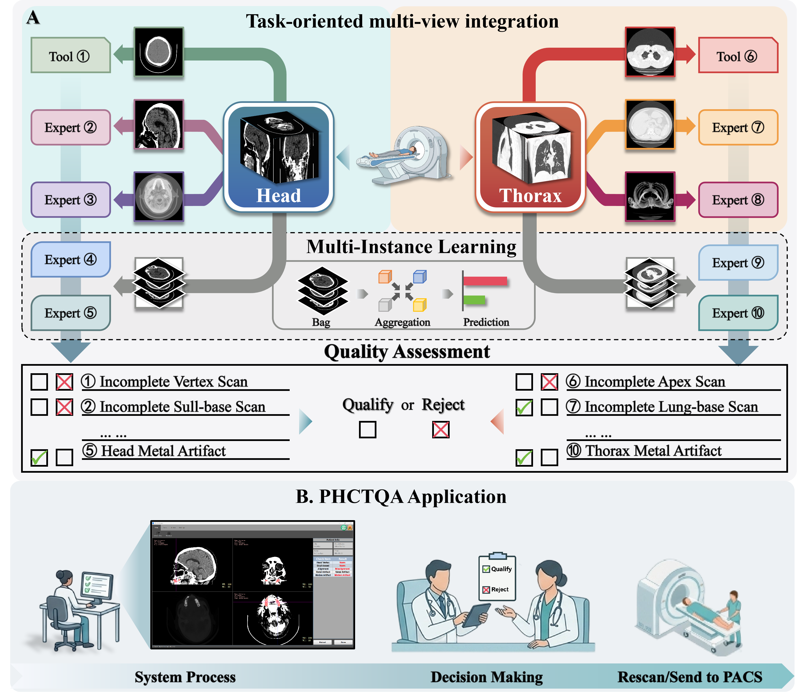

# PHCTQA: Primary Healthcare CT Quality Assessment

**Lightweight and rapid identification of ten head-thorax NCCT quality defects via physics-informed multi-view and multi-instance AI**

[](LICENSE)
[](https://www.python.org/)
[](https://pytorch.org/)

> Official implementation of the paper *"Lightweight and rapid identification of ten head-thorax NCCT quality defects via physics-informed multi-view and multi-instance AI"* (under review).

---

## Introduction

Non-contrast computed tomography (NCCT) is highly vulnerable to quality defects in low-resource healthcare settings, where a shortage of specialized radiographers leads to a high incidence of scans failing to meet diagnostic standards. **PHCTQA** is a lightweight and rapid AI system that identifies **ten head-thorax NCCT quality defects** in real time, directly at the point of scan acquisition:

| Head (5) | Thorax (5) |
|---|---|
| Incomplete head vertex scan | Incomplete thorax apex scan |
| Incomplete skull-base scan | Incomplete lung-base scan |
| Head misalignment | Thorax misalignment |
| Head motion artifacts | Respiratory motion artifacts |
| Head metal artifacts | Thorax metal artifacts |

By establishing an immediate closed-loop from scan acquisition to quality assessment, PHCTQA enables radiographers to decide whether image quality is acceptable **before the patient leaves the scanner**, reducing unnecessary rescans and patient recalls in resource-constrained primary care settings. The system runs on standard CPU hardware — no GPU required for deployment.

## Architecture

PHCTQA employs a task-oriented modular architecture comprising **ten independent expert branches**, each dedicated to one defect category:

- **Task-oriented multi-view integration (TOMVI):** each defect category is mapped to its clinically optimal observation plane, mimicking how radiologists inspect scans.
- **Physics-informed multiple instance learning (PIMIL):** for artifact-type defects, each NCCT volume is treated as a "bag" of axial slices; anatomical and intensity-based priors filter out redundant slices before an attention-based MIL module aggregates quality-related features — bypassing full-volume redundancy and enabling real-time CPU inference.
- Eight branches use deep learning models with a lightweight **EfficientNet-v2-s** backbone; the remaining two (incomplete vertex scan and incomplete apex scan) use efficient traditional image processing algorithms.



<!-- TODO: replace the Mermaid diagram with assets/framework.png (Fig. 2 of the paper) -->

## Results

### Internal development set (n = 3,018; five-fold cross-validation)

Macro-averaged performance (Mean ± Std, %) across the five defect categories of each region:

| Region | ACC | SEN | SPE | PRE | F1-score |
|---|---|---|---|---|---|
| Head | 90.93 ± 6.74 | 79.85 ± 3.89 | 92.04 ± 6.97 | 58.56 ± 12.90 | 60.87 ± 12.10 |
| Thorax | 94.50 ± 0.75 | 82.37 ± 4.08 | 94.25 ± 0.99 | 83.31 ± 3.73 | 82.52 ± 3.50 |

### Independent external test set (n = 1,697; three centers)

- Macro-average **AUC: 87.50% (head) / 86.14% (thorax)**, exceeding all comparative models across the full spectrum of operating thresholds.
- Macro-average ACC: 82.9% (head) / 92.7% (thorax).
- PHCTQA outperformed junior radiographers across defect categories and approached senior-radiographer performance; with AI assistance, junior radiographers improved by +17.5% to +37.9%, approaching the senior level.

### Efficiency and prospective clinical deployment (n = 383; two centers)

- On standard CPU hardware, PHCTQA processed each case **13.7–43.1% faster** than junior radiographers; inference time of 16.3–26.0 s per volume in the prospective workflow (second-level response with NPU acceleration).
- After deployment, the overall rescanning rates declined markedly:

| Scan type | Center C (before → after) | Center D (before → after) |
|---|---|---|
| Head | 12.0% → 4.0% | 18.1% → 6.0% |
| Thorax | 3.7% → 3.0% | 12.4% → 4.0% |

- Incidence of imaging quality defects decreased on average by 8.05% (Center C) and 4.55% (Center D).
- Good calibration for head defects (mean Brier score = 0.061); moderate calibration for thorax defects (mean Brier score = 0.168).

## Repository Structure

<!-- TODO: finalize after code reorganization -->

```
PHCTQA/
├── configs/          # Per-branch configurations (head/ and thorax/)
├── models/           # Backbones, ABMIL, traditional algorithms
├── data/             # Datasets and preprocessing
├── losses/  utils/
├── train.py          # Unified training entry
├── evaluate.py
├── inference.py      # Single-case inference → 10-defect report
├── scripts/
│   ├── run_demo.sh   # One-click demo on synthetic data
│   └── train_*.sh
└── docs/             # Data preparation guide
```

## Quick Start

<!-- TODO: installation, demo, and training instructions -->

Coming soon.

## Model Weights

<!-- TODO: download links (GitHub Releases / Zenodo) -->

Pretrained weights for the eight deep-learning branches will be made available via [GitHub Releases / Zenodo]. The two traditional algorithmic branches (incomplete vertex scan and incomplete apex scan) require no weights.

## Data Availability

The raw patient data are supervised by the corresponding institutions and are available under restricted access for non-commercial academic use upon reasonable request to the corresponding author, subject to institutional policies and a formal material transfer agreement. A **synthetic demo dataset** is included in this repository for running `scripts/run_demo.sh` without any patient data.

## Citation

If you find this work useful, please cite:

```bibtex
@article{li2026phctqa,
  title   = {Lightweight and rapid identification of ten head-thorax NCCT quality defects via physics-informed multi-view and multi-instance AI},
  author  = {Li, Yin and Long, Kaixing and Wan, Yun and Qin, Junpu and Wei, Chenghua and Li, Xi and Lv, Zhu and Liu, Xiaomei and Chen, Yijun and Long, Rifeng and Tian, Junjie and Zheng, Manman and Yuan, Guoping and Zhong, Liming and Yang, Wei and Yao, Lin},
  journal = {Under review},
  year    = {2026}
}
```

<!-- TODO: update with journal name, volume, pages, and DOI upon publication -->

## License

License to be determined. All rights reserved until a license is added.

## Contact

For questions regarding the code, please open an issue. For data access requests, please contact the corresponding authors.
