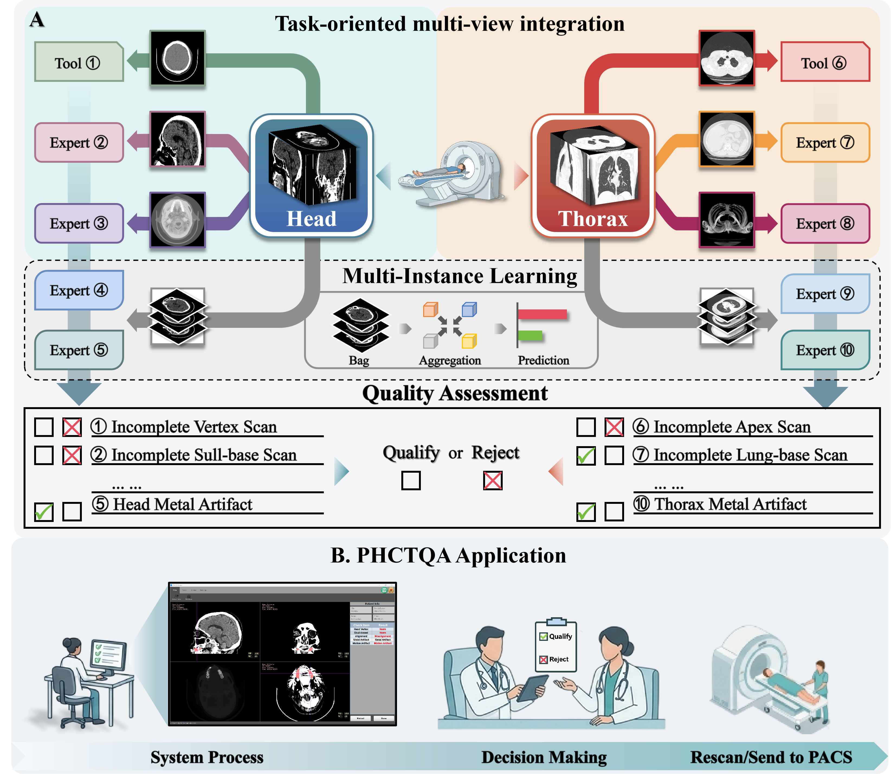
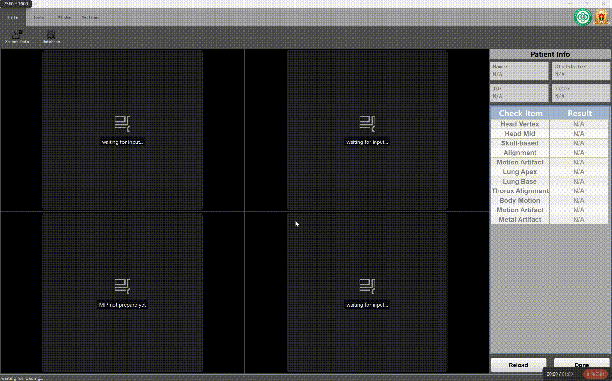

# PHCTQA: Primary Healthcare CT Quality Assessment

[](https://opensource.org/licenses/Apache-2.0)

**Lightweight and rapid identification of ten head-thorax NCCT quality defects via physics-informed multi-view and multi-instance AI**

<p align="center">
  
</p>

## Overview

Non-contrast computed tomography (NCCT) is highly vulnerable to quality defects in low-resource healthcare settings, where a shortage of specialized radiographers leads to a high incidence of scans failing to meet diagnostic standards. PHCTQA is a lightweight and rapid AI system that identifies ten head-thorax NCCT quality defects in real time, directly at the point of scan acquisition:

| Head (5) | Thorax (5) |
|---|---|
| ① Incomplete head vertex scan | ⑥ Incomplete thorax apex scan |
| ② Incomplete skull-base scan | ⑦ Incomplete lung-base scan |
| ③ Head misalignment | ⑧ Thorax misalignment |
| ④ Head motion artifacts | ⑨ Respiratory motion artifacts |
| ⑤ Head metal artifacts | ⑩ Thorax metal artifacts |

By establishing an immediate closed-loop from scan acquisition to quality assessment, PHCTQA enables radiographers to decide whether image quality is acceptable before the patient leaves the scanner, reducing unnecessary rescans and patient recalls in resource-constrained primary care settings. The system runs on standard CPU hardware — no GPU required for deployment.

## Key Features

- **Comprehensive coverage**: Simultaneously assesses 10 heterogeneous quality defects across head and thorax NCCT.
- **Task-oriented multi-view integration (TOMVI)**: Each defect category is mapped to its clinically optimal observation plane (axial, sagittal, or bone MIP), mimicking how radiologists inspect scans.
- **Physics-informed multiple instance learning (PIMIL)**: For artifact-type defects, each NCCT volume is treated as a "bag" of axial slices; anatomical and intensity-based priors filter redundant slices before an attention-based MIL module aggregates quality-related features — bypassing full-volume redundancy.
- **Lightweight & real-time**: EfficientNet-v2-s backbone; achieves second-level latency on NPU and ~20 s latency on standard CPU.
- **Clinically validated**: Trained and validated on a retrospective multi-center dataset of 4,715 patients and a prospective dataset of 383 patients from five township health centers.

## Performance Highlights

| Metric | Head | Thorax |
|---|---|---|
| Macro-average AUC (external test set) | **87.50%** | **86.14%** |
| Macro-average ACC (external test set) | **82.9%** | **92.7%** |
| Inference time (CPU, per case) | **~23 s** | **~20 s** |
| Inference time (NPU, per case) | **~1.1 s** | **~1.6 s** |

- **Speed**: On standard CPU hardware, PHCTQA processes each case **13.7–43.1%** faster than junior radiographers.
- **Clinical impact**: Prospective deployment reduced overall patient rescanning rates by up to **66.7%** (e.g., head scans at Center D: 18.1% → 6.0%).
- **AI assistance**: Providing PHCTQA outputs to junior radiographers improved their per-defect accuracy by **+17.5% to +37.9%** across external centers.

## Demo
The screen recording below shows PHCTQA performing real-time quality assessment on a thorax NCCT scan: DICOM loading → parallel multi-branch inference → quality result generation.

<p align="center">
  
</p>


## Architecture

PHCTQA employs a task-oriented modular architecture comprising ten independent expert branches, each dedicated to one defect category:

**Task-oriented multi-view integration (TOMVI)**: Each defect category is mapped to its clinically optimal observation plane, mimicking how radiologists inspect scans.

**Physics-informed multiple instance learning (PIMIL)**: For artifact-type defects, each NCCT volume is treated as a "bag" of axial slices; anatomical and intensity-based priors filter out redundant slices before an attention-based MIL module aggregates quality-related features — bypassing full-volume redundancy and enabling real-time CPU inference.

Eight branches use deep learning models with a lightweight EfficientNet-v2-s backbone; the remaining two (incomplete vertex scan and incomplete apex scan) use efficient traditional image processing algorithms.

## System Requirements

- **OS**: Linux (tested on Ubuntu 20.04/22.04), Windows 10/11
- **Python**: &gt;= 3.9
- **Dependencies**: see `requirements.txt`
- **Tested hardware**:
  - Intel x86_64 CPU
  - Huawei Ascend 910B NPU

## Installation

**1. Clone the repository**

The model weights are hosted via [Git LFS](https://git-lfs.com/). Make sure Git LFS is installed before cloning (see [https://git-lfs.com](https://git-lfs.com) for installation instructions).

```bash
git lfs install
git clone https://github.com/SMU-Lkx/PHCTQA.git
cd PHCTQA
git lfs pull
```

**2. Create a virtual environment (optional but recommended)**

```bash
python -m venv venv
source venv/bin/activate  # Linux/macOS
# venv\Script\activate  # Windows
```

**3. Install dependencies**

```bash
pip install -r requirements.txt

# (Optional) Install as an editable package
pip install -e .
```

## Quick Start

We provide two anonymized demo cases in `example/`:

```bash
# Head CT quality assessment
python -m phctqa.inference \
  --config config/inference/head.yaml \
  --input example/head_dicom \
  --output outputs/head_demo.json \
  --device cpu

# Thorax CT quality assessment
python -m phctqa.inference \
  --config config/inference/thorax.yaml \
  --input example/thorax_dicom \
  --output outputs/thorax_demo.json \
  --device cpu
```

Or use the convenience script:

```bash
bash script/run_demo.sh --config config/inference/head.yaml \
  --input example/head_dicom --output outputs/head_demo.json
```

### Expected output

A JSON report (e.g., `outputs/head_demo.json`) containing:
- `pred`: binary prediction (1 = defect present, 0 = absent) per defect category
- `probability`: predicted probability for the positive class
- `details`: defect-specific metadata (e.g., selected slice indices for MIL branches)
- `elapsed_sec`: total wall-clock time (model loading + inference)
- `inference_sec`: parallel inference wall-clock time

### Expected run time (demo on a normal desktop computer)

- **Head**: ~23 s on CPU; ~1.1 s on NPU
- **Thorax**: ~20 s on CPU; ~1.6 s on NPU

## Instructions for Use

### On your own data

1. Organize your DICOM series into one directory per patient.
2. The pre-trained weights are already included in the repository under `weight/` (tracked with Git LFS). If the files appear as small pointer stubs, run `git lfs pull` to download the actual weights.
   - `weight/head_ISB.pth`, `weight/head_MAL.pth`, `weight/head_MOT.pth`, `weight/head_MTL.pth`
   - `weight/thorax_ILB.pth`, `weight/thorax_MAL.pth`, `weight/thorax_MOT.pth`, `weight/thorax_MTL.pth`
3. Run inference:

```bash
python -m phctqa.inference \
  --config config/inference/head.yaml \
  --input /path/to/your/dicom_folder \
  --output report.json \
  --device cpu
```

### Supported input formats

- DICOM directory (series of `.dcm` files)


### Supported devices

- `cpu`: compatible with all systems
- `cuda`: NVIDIA GPU
- `npu`: Huawei Ascend NPU (requires `torch-npu`)

## Citation

If you use this software in your research, please cite:

```bibtex
@article{li2026phctqa,
  title={Lightweight and rapid identification of ten head-thorax {NCCT} quality defects via physics-informed multi-view and multi-instance {AI}},
  author={Li, Yin and Long, Kaixing and Wan, Yun and Qin, Junpu and Wei, Chenghua and Li, Xi and Lv, Zhu and Liu, Xiaomei and Chen, Yijun and Long, Rifeng and Tian, Junjie and Zheng, Manman and Yuan, Guoping and Zhong, Liming and Yang, Wei and Yao, Lin},
  journal={Nature Communications},
  year={2026}
}
```

## License

This project is licensed under the [Apache License 2.0](LICENSE).

## Contact

For questions or issues, please open a GitHub issue or contact the corresponding authors.
